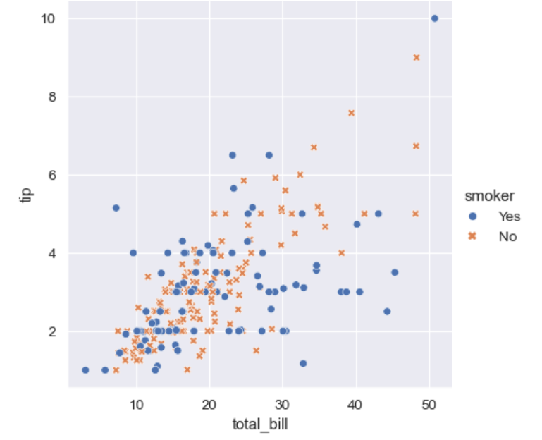
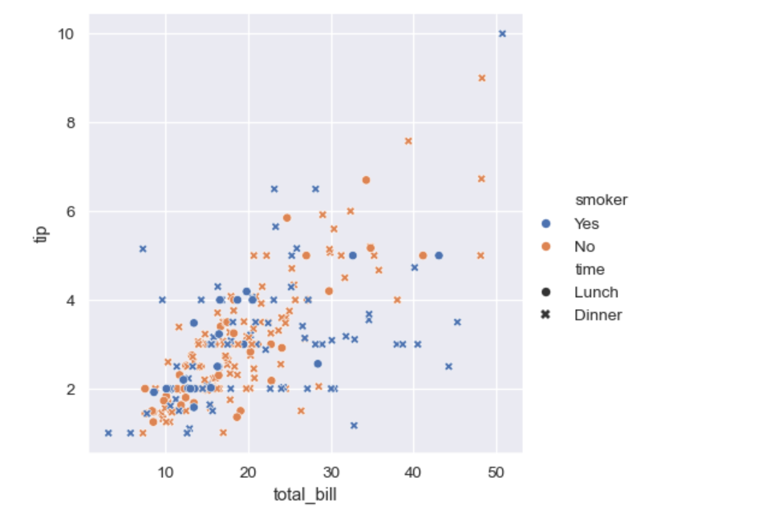
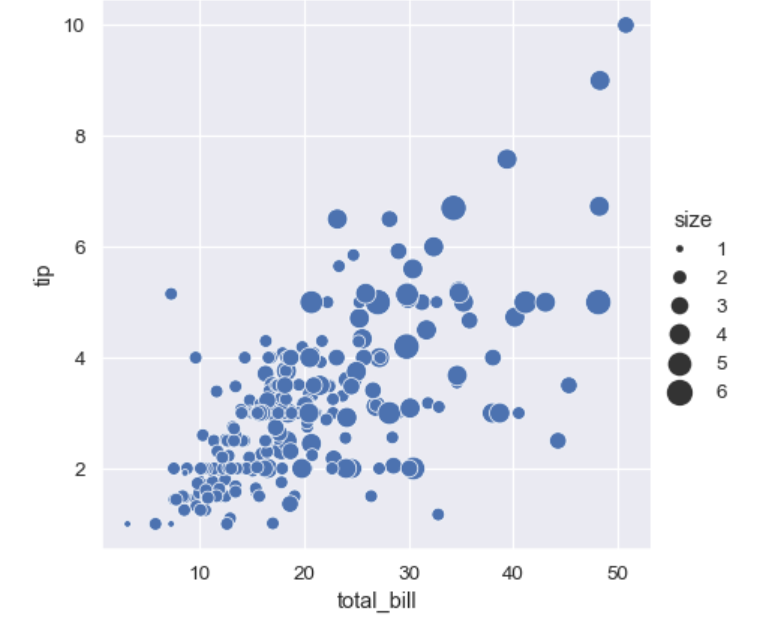
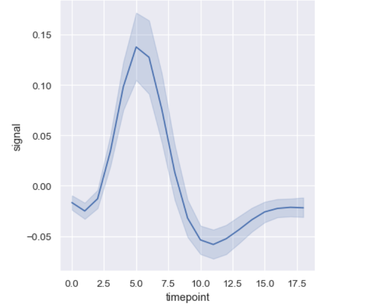
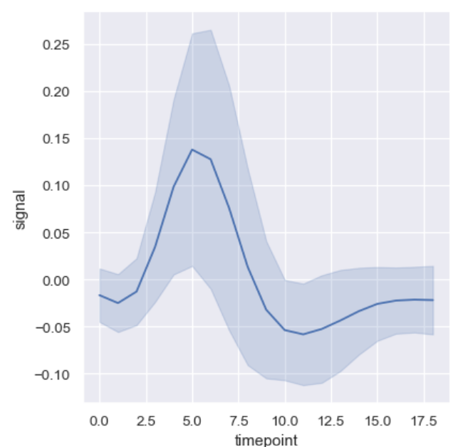
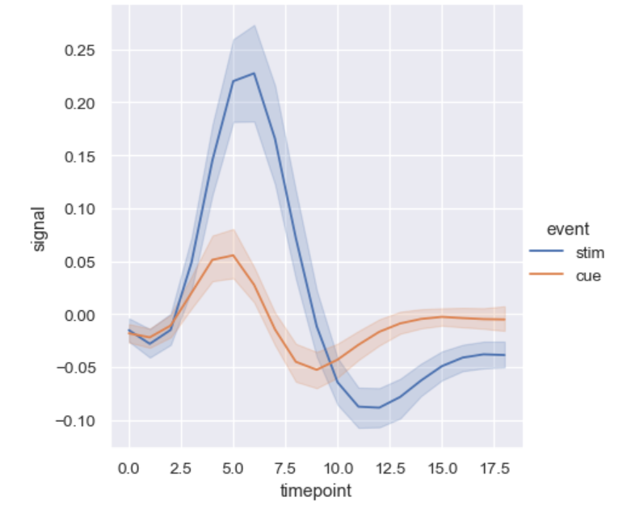
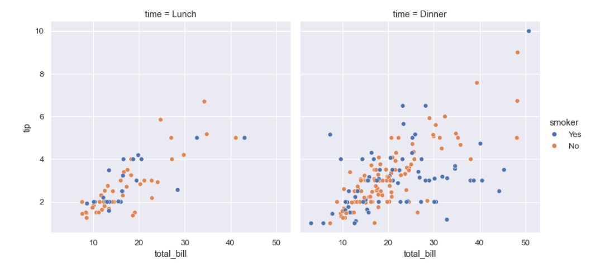
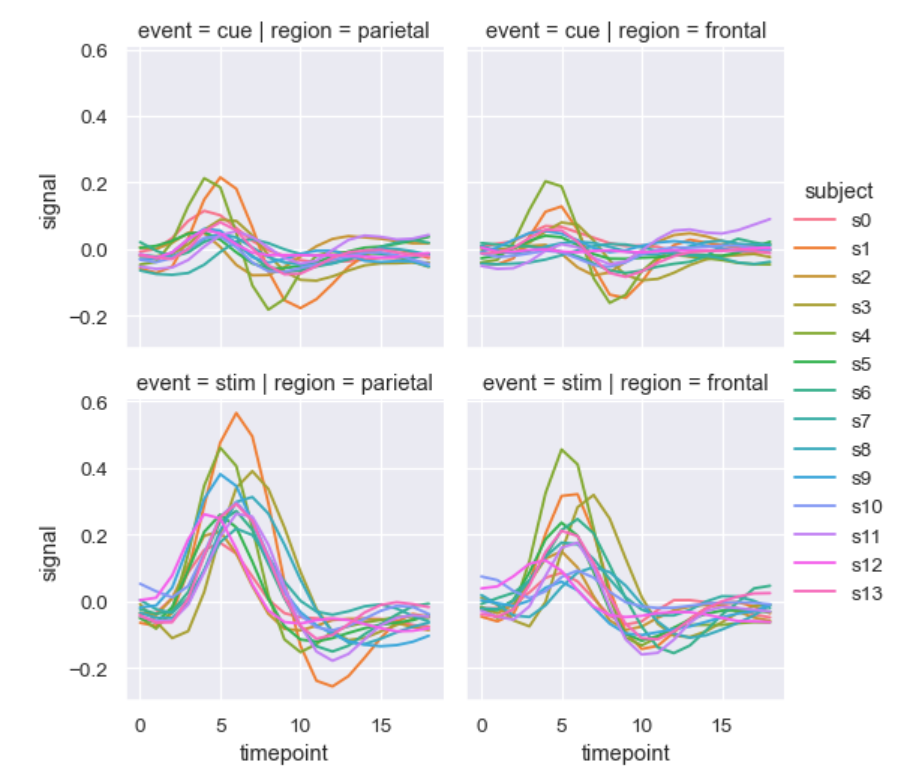
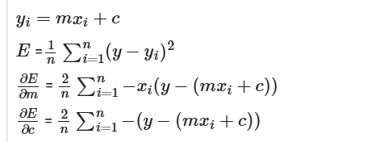

#  Matplotlib
### multiple plots
```
fig, ax = plt.subplots(1, 1, figsize=(5, 5))
ax.plot(x, y)
ax.scatter(x0, f(x0), marker='o', s=300, zorder=-2)         
#s: size, zorder: plot with higher number would be drawn infront of plot with lower number
ax.scatter(xmin, f(xmin), marker='v', s=300, zorder=20)
ax.set_xlim(-20, 20)
```

# Seaborn

### Pairplot
```
plt.style.use('ggplot')
sns.pairplot(auto)
```

### Heatmap
```
auto = auto.apply(pd.to_numeric, errors='coerce')
plt.figure(figsize=(8, 8))
sns.heatmap(auto.corr(), annot=True, linewidth=0.5, center=0)
plt.show()
```

### matplotlib subplots
```
fig, ax = plt.subplots(1, 2, figsize=(16, 6))
fig.subplots_adjust(left=0.0625, right=0.95, wspace=0.1)
ax[i].plot(X, y, color='red', label='label name')
```


### relative comparison of X vs Y, colored differently based on column Z

```
sns.relplot(
    data=tips,
    x="total_bill", y="tip", hue="smoker", style="smoker"
)
```


### relative comparison of X vs Y, colored differently based on column Z, shapes based on column A
```
sns.relplot(
    data=tips,
    x="total_bill", y="tip", hue="smoker", style="time"
)
```



### plot with custom color palette
cubehelix_palette()
```
sns.relplot(
    data=tips,
    x="total_bill", y="tip",
    hue="size", palette="ch:r=-.5,l=.75"
)
```

### plot with varying size
Unlike with matplotlib.pyplot.scatter(), the literal value of the variable is not used to pick the area of the point. Instead, the range of values in data units is normalized into a range in area units. This range can be customized

```
sns.relplot(
    data=tips, x="total_bill", y="tip",
    size="size", sizes=(15, 200)
)
```



## Aggregation and representing uncertainty

More complex datasets will have multiple measurements for the same value of the x variable. The default behavior in seaborn is to aggregate the multiple measurements at each x value by plotting the mean and the 95% confidence interval around the mean:

```
fmri = sns.load_dataset("fmri")
sns.relplot(data=fmri, x="timepoint", y="signal", kind="line")
```


Another good option, especially with larger data, is to represent the spread of the distribution at each timepoint by plotting the standard deviation instead of a confidence interval:

```
sns.relplot(
    data=fmri, kind="line",
    x="timepoint", y="signal", errorbar="sd",
)
```


## Splitting observations in line plot

```
sns.relplot(
    data=fmri, kind="line",
    x="timepoint", y="signal", hue="event",
)
```


Use markers=True to see the markers


## Splitting plot into multiple subplots
Use col=
```
sns.relplot(
    data=tips,
    x="total_bill", y="tip", hue="smoker", col="time",
)
```


## adding more variables to split the plot
```
sns.relplot(
    data=fmri, kind="line",
    x="timepoint", y="signal", hue="subject",
    col="region", row="event", height=3,
    estimator=None
)
```


# Pandas

## Addng new column with counts to a dataframe

Option 1: 

```
df['count'] = df.groupby('group')['group'].transform('count')
```

Option 2:
```
df_new = df.groupby(['column1','column2'])['column3'].count().reset_index()
df_holiday.rename(columns={'column3':'countOfcolumn3'},inplace=True)
df_holiday
```

# Data wrangling 

### Imputing nan values
from sklearn.impute import SimpleImputer
imputer = SimpleImputer(strategy='mean')
X = imputer.fit_transform(X)
X = pd.DataFrame(X, columns=['displacement', 'horsepower', 'acceleration', 'model year', 'origin'])

# Machine learning

## Gradient Descent

### Batch gradient descent
Batch Gradient Descent is when we sum up over all examples on each iteration when performing the updates to the parameters. Therefore, for each update, we have to sum over all examples:

w=w−α▽wJ(w)

```
# function to update m and c
def train(x, y, m, c, eta):                   
# x = independent variable, y = dependent variable, m = coeff. of independent var (slope), 
# c = constant (bias), eta = learning rate
    const = - 2.0/len(y)                      # constant term to be used in compting gradients
    ycalc = m * x + c                         # linear regression expression
    delta_m = const * sum(x * (y - ycalc))    # dy/dm
    delta_c = const * sum(y - ycalc)          # dy/dc
    m = m - delta_m * eta                     # gradient descent step to update m
    c = c - delta_c * eta                     # gradient descent step to update c
    error = sum((y - ycalc)**2)/len(y)        # error
    return m, c, error
```

```
# Save errors
errs_1 = []
m, c = 0, 0         # initial guess
eta = 0.1           # learning rate

# Call the train() method for 2000 iterations to update m and c and get error value with eta = 0.1
for iteration in range(2000):
    m, c, error = train(X, y, m, c, eta)
    errs_1.append(error)

# Save final line
m_1, c_1 = m, c
m_1, c_1

```

### Stochastic gradient descent

nstead of going through all examples, Stochastic Gradient Descent (SGD) performs the parameters update on each example  (xi,yi) . Therefore, learning happens on every example:
w=w−α▽wJ(xi,yi;w)

- given the equation  yi=mxi+c 
- we calculate the error as  E  =  (y−yi)2  ; where  y  is the ground truth and  yi  is the prediction
- Finding the rate of change in error with respect to m is  ∂Ei/∂m  =  −2(yi−(mxi+c))∗xi 
- rate of change in c is  ∂Ei/∂c  =  −2(yi−(mxi+c)) 
- And then we update the slope and bias with change in slope  Δm  and change in bias  Δc  with learning rate  eta 

m  =  m−Δm∗eta 
c  =  c−Δc∗eta

```

# change in m and c
def next_step(x, y, m, c, eta):
    ycalc = m * x + c                # linear regression expression
    error = (y - ycalc) ** 2         # error
    delta_m = -2 * (y - ycalc) * x   # dy/dm
    # YOUR CODE HERE to create 'delta_c'         # dy/dc
    delta_c = -2 * (y - ycalc)
    m = m - delta_m * eta            # gradient descent step to update m
    # YOUR CODE HERE to update 'c'     # gradient descent step to update c
    c = c - delta_c * eta
    return m, c, error
```

```
# update m and c for one data point
def one_loop_random(x, y, m, c, eta):
    # Making random idx
    random_idx = np.arange(len(y))
    np.random.shuffle(random_idx)
    # Training with random idx
    for idx in random_idx:
        m, c, e = next_step(x[idx], y[idx], m, c, eta)
        #print(m, c, e)
        print('m: {0}, c: {1}, e: {2}'.format(m,c,e))
    return m,c,e
```

```
def train_stochastic(x, y, m, c, eta, iterations=1000):
    for iteration in range(iterations):
        m, c, err = one_loop_random(x, y, m, c, eta)
    return m, c, err
```

```
ms, cs, errs = [], [], []
lr = 0.001
m,c = 0,0
for num in range(10):
    m, c, error = train_stochastic(X, y, m, c, lr, iterations=100)
    print("m = {0:.6} c = {1:.6} Error = {2:.6}".format(m, c, error))
    ms.append(m)
    cs.append(c)
    errs.append(error)    
    y = m * l + c
```

### mini-batch gradient descent
In Mini-Batch Gradient Descent algorithm, rather than using the complete data set, in every iteration we use a subset of training examples (called "batch") to compute the gradient of the cost function.

We assume there are  n  samples in a batch  B , for all  i∈B ,


```
def train_one_batch(x, y, m, c, eta):
    const = - 2.0/len(y)
    ycalc = m * x + c                             # linear regression expression
    delta_m = const * sum(x * (y - ycalc))        # dy/dm
    # YOUR CODE HERE to create 'delta_c'          # dy/dc
    m = m - delta_m * eta                         # gradient descent step to update m
    # YOUR CODE HERE to update 'c'                # gradient descent step to update c
    error = sum((y - ycalc)**2)/len(y)            # error
    return m, c, error

"""
The function below takes a batch_size and loss is calculated w.r.t batches.
The batches are created using random index.
The m, c and error values are calculated for each batch of data.
So, it calls the function 'train_one_batch()' by passing batch_x, batch_y for each batch.
"""
def train_batches(x, y, m, c, eta, batch_size):
    # Making the batches
    random_idx = np.arange(len(y))
    # YOUR CODE HERE to randomly shuffle 'random_idx'
    np.random.shuffle(random_idx)
    # Train each batch
    for batch in range(len(y)//batch_size):
        batch_idx = random_idx[batch*batch_size:(batch + 1)*batch_size]
        batch_x = x[batch_idx]
        batch_y = y[batch_idx]
        m, c, err = train_one_batch(batch_x, batch_y, m, c, eta)

    return m, c, err

"""
The function below trains the data for 1000 iterations.
The data is traversed in batches, the batch size here is considered to be 10.
In each iteration it calls the 'train_batches' function.
The 'batch_size' is passed as a parameter to 'train_batches'.
"""
def train_minibatch(x, y, m, c, eta, batch_size=10, iterations=1000):
    for iteration in range(iterations):
        m, c, err = train_batches(x, y, m, c, eta, batch_size)
    return m, c, err
```

```
# Initializing m, c
m, c = 0, 0
# Learning rate
lr_range = [0.01,0.5,0.0001]

# Call the train_minibatch() method to update m and c and get error value with lr = 0.001 and batch_size=90.
for lrr in lr_range:
  m, c = 0, 0
  for num in range(10):
      # We will plot the error values for every 100 iterations
      m, c, error = train_minibatch(X, y, m, c, lrr, batch_size=90, iterations=100)
      print("Learning rate:{0} : m = {1}, c = {2}, Error = {3}".format(lrr, m, c, error))
      y = m * l + c
      
  # YOUR CODE HERE to plot data point and regression line
  fig, ax = plt.subplots(1,1, figsize=(5,5))
  ax.plot(l, tsq, '.k')
  ax.plot(l, y)
  plt.xlabel("learning rate: {0}".format((lrr)), fontsize=12)
  plt.ylabel("Error", fontsize=12)

```

