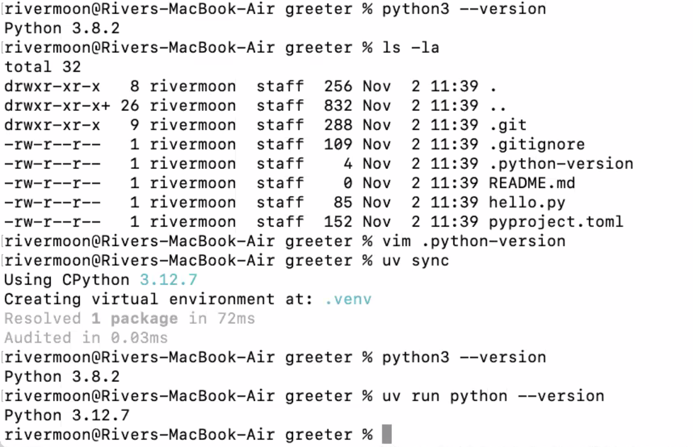

__main__ : dunder method - the namespace where the current module exists
__init__ : dunder method - first function called constructor is called
self : not a keyword but conventionally we need to use self . It is explicitly specified and implicitly passed. It is a reference to the instance
You ccan add a method outside the class to the object
static method, can be defined where method is within the class but doesnt use self

__repr__ : representation or more informational when inspecting the instance of object. used for design choice
__str__ : what should be displayed when we print the instance of the object. used by programmers. who consume your class. If this is not implemented, it takes the __repr__ output. vice versa is not true.

any class, should at a minimum have __repr__ .

3-tier hierarchy:
1. - ppl who write packacages and libraries
2. - ppl who consume these and write programs
3. - ppl who consume the program

repr - written bu tier-1 for tier-2
str - written by tier-1 for tier-3

other dunder methods
 __eq__
 __lt__ 
 if the above 2 are defined, the remaining rich comparison methods will be defined based on this like __gt__, __ne__, __ge__, __le__

 Look at itertools - accumulate among others

 my ref:
 

# Co-routines 
 - **single use**, **just-in-time** generators which retain values from previous calls. 
 - calling program calls this method and this returns value at the point 'yield' is mentioned, control goes to the callling program until it is called again. When it is called again, execution continues from statement after yield.
 - Note if you set a limit in the generator, once the limit is exhausted if you call generators again, it wont give any results
 - if limit is not reached but you call with a new limit, it becomes a new generator
 - Map , filter, zip all are generators
 - if we use list comprehension , then we are losing the advantage of just in time as we end up creating a list. You can use () instead of [] to overcome this
 - Generators reduce the memory footprint without impacting the performance

 Create search space of data (like permutations output) as generators and create function to validate this against the constraints / validator(like checking agaisnt keylog in euler79) until you get values that match.

 # PANDAS 
 -you can access columns by column name using :
    - dictionary notation data['Height'] : suited for badly named columns
    - object notation data.Height : not suited when column names have spaces
 -it can generally handle data size of 40% of RAM size

**Install PengWin which works with wsl on windows**

# The visual representation of quantitative data book by Edward Tufte

# Seaborn - built on matplotlib - focussed on statistical visualizations

# bokeh if you are working on web for interactive charts

# Altair - declarative way of generating charts

# GIT
 git commit -m "comment" <optional: filename> 
so you can stage multiple files but only commit specific ones

 git config --global init.defaultBranch Main 
 To change the defaultBranch name

git commit --amend --reset-author
to change the author for that commit

git restore <filename>
to undo changes that are saved but not staged.

git log 
to view the trail of changes

if we omit -m in git commit it'llopen an editor to add longer commit messages
we can set the default editor to vs code using "code --wait" in command
git config --global core.editor "code --wait"

esc -wq
- to exit from vi editor from git bash

man git
- helpful commands

git help commit
shows options for commit command 

git diff <first 6 chars of commit ID of orig file> <first 6 chars of commit of updated file>
shows difference. you can give first 4 chars or 5 chars as well.. prefer 6 chars

git commit --amend
opens the last commit and allows you to make changes

# UV

https://docs.astral.sh/uv/getting-started/installation/

it installs dependencies in UV's cache folder and doesn't change the underlying system's software.

https://peps.python.org/pep-0621/

uv init
 - creates project 
if it is not within another git repo, uv init also initialises the folder with git 

uv sync
- if the underlying system's python is of an older version and we wnt our program to run on a new one.
.python-version created by uv init command and change the version we need here, and also give this new version even in the python.toml file. Then running the sync command will install the latest version in UV'scache

uv run python --version
shows version of python in UV's environment

** on gitbash type: fg  if you have accidentally done cntrl+z from edit file mode on gitbash which sends the current file to background and you maynot be able to edit that file until you type fg

- so for any command of any library, 
   if it is to execute, append uv run before the command
   if it is to install, use uv add <whatever the installable>
   e.g. uv add flask 
   this will install the dependency and update pyproject.toml with the dependency
   
   uv run flask --app hello run
   flask quickstart page has the command flask --app hello run, instead we append uv run so trigger it via uv which manages dependencies. 

   https://flask.palletsprojects.com/en/stable/quickstart/

# numpy - matplotlib
df.columns
df.<columnanme>.nunique