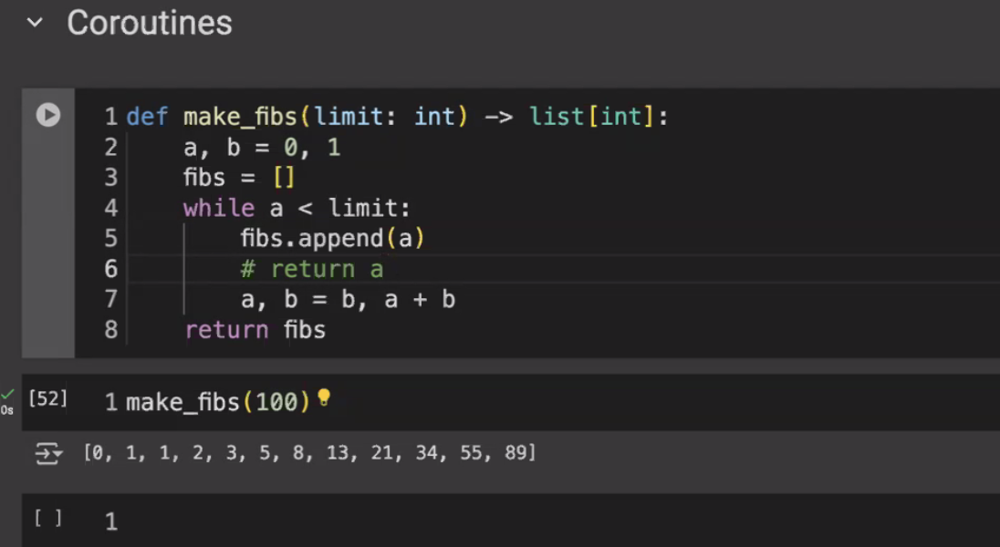

__main__ : dunder method - the namespace where the current module exists
__init__ : dunder method - first function called constructor is called
self : not a keyword but conventionally we need to use self . It is explicitly specified and implicitly passed. It is a reference to the instance
You ccan add a method outside the class to the object
static method, can be defined where method is within the class but doesnt use self

__repr__ : representation or more informational when inspecting the instance of object. used for design choice
__str__ : what should be displayed when we print the instance of the object. used by programmers. who consume your class. If this is not implemented, it takes the __repr__ output. vice versa is not true.

any class, should at a minimum have __repr__ .

3-tier hierarchy:
1. - ppl who write packacages and libraries
2. - ppl who consume these and write programs
3. - ppl who consume the program

repr - written bu tier-1 for tier-2
str - written by tier-1 for tier-3

other dunder methods
 __eq__
 __lt__ 
 if the above 2 are defined, the remaining rich comparison methods will be defined based on this like __gt__, __ne__, __ge__, __le__

 Look at itertools - accumulate among others

 my ref:
 

# Co-routines 
 - **single use**, **just-in-time** generators which retain values from previous calls. 
 - calling program calls this method and this returns value at the point 'yield' is mentioned, control goes to the callling program until it is called again. When it is called again, execution continues from statement after yield.
 - Note if you set a limit in the generator, once the limit is exhausted if you call generators again, it wont give any results
 - if limit is not reached but you call with a new limit, it becomes a new generator
 - Map , filter, zip all are generators
 - if we use list comprehension , then we are losing the advantage of just in time as we end up creating a list. You can use () instead of [] to overcome this
 - Generators reduce the memory footprint without impacting the performance

 Create search space of data (like permutations output) as generators and create function to validate this against the constraints / validator(like checking agaisnt keylog in euler79) until you get values that match.